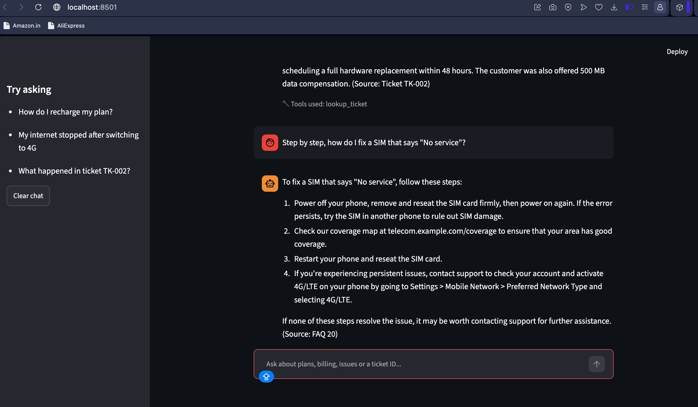
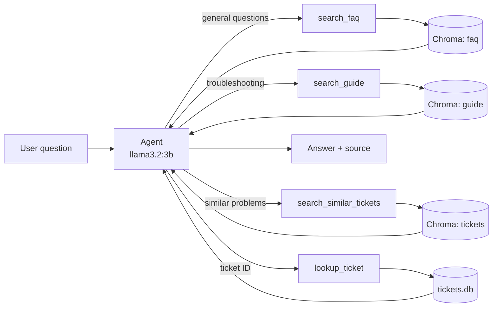

# 📡 Telecom Support Agent

A RAG-based AI support agent that answers telecom customer questions from three different data sources: a **FAQ** (CSV), a **telecom guide** (PDF) and **past support tickets** (SQLite). The agent decides which source to search for each question, answers only from what it finds and cites its source.



## Features

- Answers general questions (plans, billing, recharge, roaming) from the FAQ
- Answers troubleshooting questions from the telecom guide PDF, with page numbers
- Finds similar past tickets and how they were resolved
- Looks up a specific ticket by ID (for example `TK-002`)
- Cites the source of every answer (FAQ id, guide page or ticket id)
- Says it doesn't know when nothing relevant is found
- Remembers the conversation, so follow-up questions work
- Runs fully locally: local embeddings and a local Ollama model, no API key
- Two interfaces: terminal chat and a Streamlit web chat

## Tech stack

| Part | Tool |
|---|---|
| Agent framework | LangChain (`create_agent`) |
| LLM | Ollama, `llama3.2:3b` (local) |
| Embeddings | `sentence-transformers/all-MiniLM-L6-v2` (local) |
| Vector database | ChromaDB |
| PDF parsing | pypdf |
| Data handling | pandas, sqlite3 |
| Web UI | Streamlit |

## How it works



1. **Ingest (run once).** Each data source is turned into text chunks with metadata, embedded and stored in its own ChromaDB collection.
2. **Tools.** Each source becomes a tool. The tool's description tells the model when to use it.
3. **Agent.** The model reads the question, calls the right tool, reads the result and writes an answer that cites the source.

## Data sources

| File | What it holds | How it is stored |
|---|---|---|
| `data/faq.csv` | Question and answer rows with a category and id | 25 documents in the `faq` collection, one per row |
| `data/telecom_guide.pdf` | Troubleshooting guide | 29 chunks (800 characters, 100 overlap) in the `guide` collection, with page numbers |
| `data/tickets.db` | SQLite table `tickets` (`ticket_id`, `category`, `issue_type`, `description`, `resolution`, `status`) | 20 documents in the `tickets` collection, plus direct SQL lookup by `ticket_id` |

## Tools

| Tool | Used for |
|---|---|
| `search_faq` | Plans, billing, recharge, roaming and policies |
| `search_guide` | Detailed troubleshooting steps and procedures |
| `search_similar_tickets` | "Has this happened before?" questions |
| `lookup_ticket` | Details of one ticket by ID. It opens the database read-only, so the model can't change data |

## Project structure

```
telecom-chatbot/
├── data/
│   ├── faq.csv
│   ├── telecom_guide.pdf
│   └── tickets.db
├── docs/
│   └── streamlit-demo.png
├── ingest_faq.py        # CSV -> Chroma 'faq' collection
├── ingest_pdf.py        # PDF -> Chroma 'guide' collection
├── ingest_tickets.py    # SQLite -> Chroma 'tickets' collection
├── tools.py             # the four agent tools
├── agent.py             # agent + terminal chat
├── app.py               # Streamlit web chat
├── requirements.txt
└── README.md
```

## Setup

You need Python 3.12 or newer (built and run on 3.14) and [Ollama](https://ollama.com).

```bash
# 1. Clone and enter the project
git clone https://github.com/Sinan-ck/telecom-chatbo.git
cd telecom-chatbo

# 2. Create a virtual environment
python3 -m venv .venv
source .venv/bin/activate

# 3. Install dependencies
pip install -r requirements.txt

# 4. Download the local model (about 2 GB)
ollama pull llama3.2:3b
```

## Usage

**Step 1: build the vector database (run each script once).**

```bash
python ingest_faq.py        # Done. 25 vectors stored.
python ingest_pdf.py        # Done. 29 vectors stored.
python ingest_tickets.py    # Done. 20 vectors stored.
```

If you change a data file, delete the `chroma_store` folder and run the scripts again. Running `ingest_faq.py` twice without deleting it stores every FAQ twice.

**Step 2: chat with the agent.**

```bash
python agent.py          # terminal chat; prints which tool was called
streamlit run app.py     # web chat at http://localhost:8501
```

Make sure Ollama is running (menu bar icon, or `ollama serve`).

## Example questions

| Question | Tool used |
|---|---|
| How do I recharge my plan? | `search_faq` |
| My internet stopped working after switching to 4G | `search_guide` |
| Has any customer had signal drops in the suburbs? | `search_similar_tickets` |
| What happened in ticket TK-002? | `lookup_ticket` |
| What happened in ticket TK-999? | `lookup_ticket` (answers "not found") |
| Who won the cricket match yesterday? | no tool (answers "I don't know") |

## Limitations

- A small 3B model sometimes picks a weaker tool or skips a second tool when a question needs two. A larger model (or an API model) improves this.
- Answers are only as good as the data. The agent is told to answer only from tool results and to say when it doesn't know.
- The FAQ, guide and tickets are small sample data, so this is a learning project, not a production system.

## Ideas for next steps

- Memory that survives restarts
- Guardrails for off-topic or unsafe questions
- An evaluation set that checks the right tool and ticket id are returned
- A tool that creates new support tickets
- Swap in a stronger model through an API

## Credits

Built while following the *Agentic AI Crash Course using LangChain* by [codebasics](https://www.youtube.com/@codebasics) (Project 2: Telecom RAG chatbot). The sample data files come from that course, so check the course repository's license before reusing or redistributing them.
